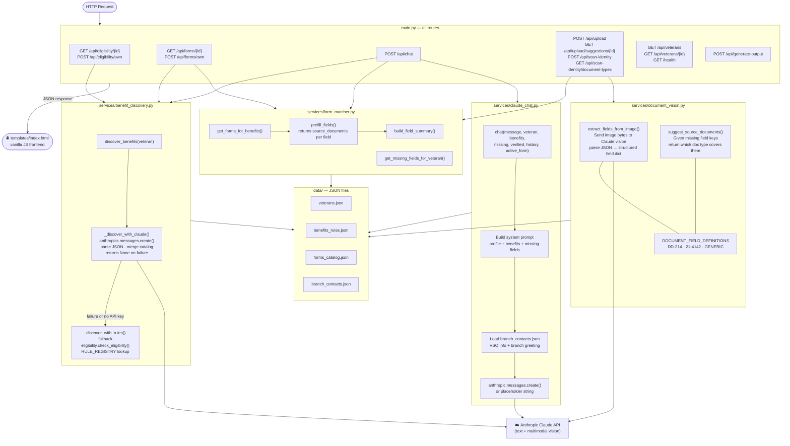
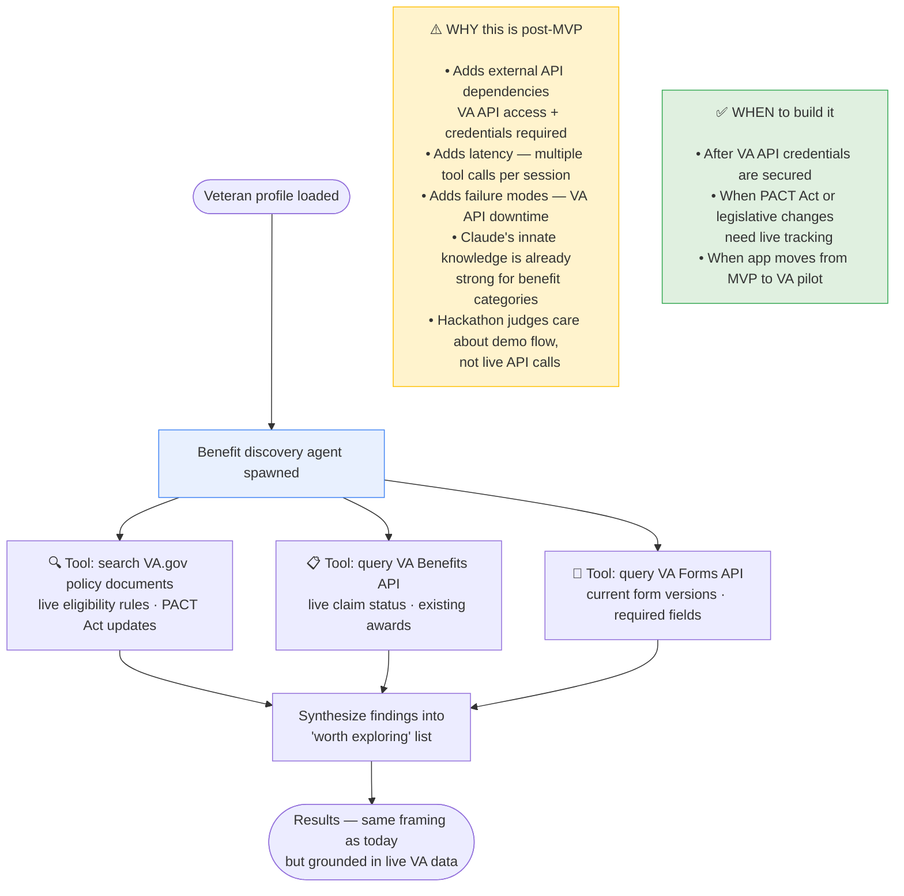

# CLAUDE.md — VetAssist Architecture Guide

This file is for Claude Code and any developer continuing work on this project.
Read this before making changes.

---

## Project purpose

VetAssist is a one-week hackathon MVP built for the Wilcore Innovation Challenge.
It helps veterans identify likely VA benefits, understand what forms they need,
see which fields can be prefilled from their profile, and ask a conversational
assistant for missing information.

**VetAssist is a preparation tool — not a decision maker.**
The VA and the veteran's VSO make all eligibility determinations.
We help veterans know what to ask about and get their paperwork ready.

---

## Architecture overview

```
main.py                     FastAPI app — all routes live here
services/
  benefit_discovery.py      Claude-first benefit discovery; rules fallback
  eligibility.py            Hardcoded rules engine (fallback mode only)
  form_matcher.py           Maps benefits → forms, prefills fields, flags missing
  claude_chat.py            Conversational assistant (Anthropic API or placeholder)
  document_vision.py        Claude multimodal vision — reads document photos, extracts fields
data/
  veterans.json             3 synthetic veteran profiles (no real PII)
  benefits_rules.json       5 benefit definitions used by the rules fallback
  forms_catalog.json        5 VA form definitions with field metadata
  branch_contacts.json      VSO contacts + branch-specific benefit notes
templates/
  index.html                Single-page frontend (vanilla JS, no framework)
forms_to_verify/
  README.md                 Explains the folder and mockup images
  *.png                     Mockup images for testing document photo-to-prefill flow
```

**The data layer is JSON files.** There is no database.
This is correct for the MVP — easy to run, demo, and explain to non-technical judges.

---

## Service interaction map



---

## How benefit discovery works

This is the most important architectural decision in the project. Read carefully.

### Default mode — Claude-first

When `ANTHROPIC_API_KEY` is set in the environment:

1. `benefit_discovery.py` sends the veteran's full profile to Claude
2. Claude reviews it using its own knowledge of VA benefits — the same way
   a knowledgeable VSO would reason about the case
3. Claude returns a JSON list of benefits worth exploring, with plain-language
   reasons specific to that veteran
4. Results are merged with catalog metadata (titles, descriptions, VA.gov links)
5. Everything is framed as "worth exploring" — never "eligible" or a determination

**Why Claude and not rules for this?**
VA benefit eligibility is nuanced. Rules change. Edge cases exist. A veteran's
situation rarely fits neatly into simple if/else logic. Claude can reason across
combinations of factors — branch, discharge type, combat history, specific conditions,
income, dependents — and frame results as possibilities, not determinations.

### Fallback mode — hardcoded rules engine

When no API key is configured, or when Claude returns malformed output:

1. `_discover_with_rules()` in benefit_discovery.py is called
2. This calls `check_eligibility()` in `services/eligibility.py`
3. The `RULE_REGISTRY` dict maps benefit IDs to pure Python rule functions
4. Same "worth exploring" framing is applied to the output

**What the fallback is for:**
- Running locally without an API key (setup, development, offline demo)
- Graceful degradation if the API is unreachable during the presentation

**What the fallback is NOT for:**
- The default path. Do not add hardcoded eligibility rules as a substitute for Claude.
- The fallback is a safety net, not a design goal.

### Framing — non-negotiable rules

These apply in BOTH modes and cannot be relaxed:

- Always say "worth exploring" — never "eligible" or "you qualify"
- Always show disclaimer banner before benefit cards
- Always include "Talk to your VSO or the VA to confirm" on every benefit
- Always include a VA.gov "Learn more" link on every benefit card
- VetAssist is a preparation tool. The VA makes the determination.

---

## What is real vs. what is a placeholder

| Component | Status | Notes |
|---|---|---|
| Veteran profile loading | REAL | Reads from data/veterans.json |
| Manual profile entry | REAL | Veteran enters their own info via form in the UI; POST /api/eligibility/own and POST /api/forms/own accept the profile inline |
| Step 1 document scan | REAL (with API key) | Veteran photographs DD-214, military ID, or VA letter on Step 1; POST /api/scan-identity extracts identity/service fields via Claude vision; maps to own-info form inputs; veteran reviews before continuing |
| Benefit discovery | REAL | Claude-first; rules fallback |
| Form field prefill | REAL | Maps profile fields to form fields (16–34 fields per form, with field_type, options, required metadata) |
| Document type suggestions | REAL | suggest_source_documents() — tells veteran which doc has missing fields |
| Document photo → field extraction (Step 3) | REAL (with API key) | Claude multimodal vision in document_vision.py; veteran confirms every field |
| Conversational assistant | REAL (with API key) | Placeholder string without key |
| PDF generation / output | REAL | POST /api/generate-output generates a PDF package (cover page + field summary sheet) via reportlab; returns as file download |
| VA API integration | STUB | Uses local JSON instead |
| Authentication | NOT IMPLEMENTED | Not needed for MVP |
| Database | NOT IMPLEMENTED | Not needed for MVP |

---

## Key constraints — do not violate these

- **No database.** JSON files are the data layer.
- **No authentication.** Not needed for a local demo.
- **No cloud deployment.** This runs locally with `python -m uvicorn`.
- **No complex frontend framework.** One HTML file with vanilla JS.
- **No overengineering.** If a feature is not needed for the main happy-path demo, skip it.
- **Minimal dependencies.** Only what is in requirements.txt.
- **No hardcoded eligibility decisions in the default path.** Claude drives it.

---

## Running the app

**Setup (one time)**
```bash
pip install -r requirements.txt
cp .env.example .env   # optionally add ANTHROPIC_API_KEY=sk-...
```

**Run / re-run**
```bash
python -m uvicorn main:app --host 0.0.0.0 --port 8000 --reload
# open http://localhost:8000
```

The app runs without an API key — benefit discovery falls back to the rules engine,
and Claude chat responses show a placeholder message.

---

## Happy-path demo flow

1. User opens http://localhost:8000
2. Selects a veteran from the dropdown (e.g. Maria Sanchez) OR clicks "Enter my own information" and fills out the 20-field form OR clicks "Scan a document" and photographs their DD-214/military ID/VA letter to auto-fill the form
3. Clicks "Load Profile" / "Continue with My Information" — sees profile summary and appreciative greeting
4. Sees disclaimer banner, then benefit cards with reasons and VA.gov links
5. Sees suggested VA forms — tabs for each, with prefilled fields and missing fields
6. Veteran reviews prefilled fields (green) and missing fields (amber) — all shown as editable inputs
7. Veteran edits anything incorrect, fills in missing fields, and optionally uploads a document photo
8. Clicks “Confirm All & Continue” — required fields validate before proceeding
9. Types a question or answer in the chat — receives a response from Claude (or placeholder)

This is the one flow to keep working. Do not break it.

---

## Agentic future state (post-MVP — do not build now)

The current architecture has Claude running from its innate knowledge.
This is intentional for the MVP — simpler, faster, no external dependencies.

**What an agentic version would add:**



**The right trigger for adding agents:**
When Claude says "I'm uncertain about this specific regulation" — that's when
you add a targeted search tool for that uncertainty. Not before.

---

## What to build next (post-MVP priority order)

1. **Expand document vision** — Currently supports DD-214 and 21-4142 in DOCUMENT_FIELD_DEFINITIONS.
   Add more document types (VA award letters, service records, medical nexus letters).
   For federal deployment, swap Claude vision for AWS Textract (FedRAMP-authorized).
   - Endpoint: POST /api/upload is real and working; GET /api/upload/suggestions/{id} is also live.
   - See services/document_vision.py for the extraction logic and field definitions.

2. **XFA form fill** — Write field values directly into the official VA fillable PDF
   - Requires Adobe SDK or a cloud PDF service (VA forms use proprietary XFA format)
   - Current implementation (REAL): cover page + field summary sheet via reportlab
   - Endpoint: POST /api/generate-output (fully implemented)

3. **Multi-turn conversation history** — Persist chat turns server-side per session

4. **Real VA Forms API** — Replace forms_catalog.json with live data from api.va.gov

5. **AWS Bedrock integration** — Swap Anthropic direct API for Bedrock Claude endpoint
   - Required for FedRAMP / federal deployment
   - Not a pure config swap: requires changing SDK client from `anthropic.Anthropic()`
     to `boto3.client("bedrock-runtime")` and updating the invoke method signature
   - Message payload structure is compatible; auth model and client differ
   - Estimated effort: 0.5–1 day — not a one-liner, but not a rewrite either

6. **Authentication** — Add for any real deployment (VA PIV or login.gov integration)

7. **Database** — Replace JSON files with PostgreSQL or DynamoDB once data grows

8. **Agentic benefit discovery** — See agentic future state section above

---

## How document photo-to-prefill works

This is a built, working feature in the MVP. Read this before modifying it.

**Why Claude vision and not OCR:**
Traditional OCR fails on skewed photos, stamps, handwriting, and low-contrast backgrounds
— all common in veteran documents. Claude vision understands documents semantically:
it knows what a DD-214 looks like, where the discharge type box is, and what to do with
a partial or obscured field. No special dependencies needed beyond the Anthropic SDK.

**Key constraint — never auto-fill:**
Every field extracted from a document photo must be confirmed by the veteran before
it populates their form. A blurry photo or redacted field can produce a wrong value.
The frontend enforces this via the vision confirm modal in `templates/index.html`.

**The two functions in document_vision.py:**
- `extract_fields_from_image()` — sends image bytes + target field list to Claude vision,
  returns a structured dict of extracted values
- `suggest_source_documents()` — given a list of missing field keys, returns which
  document types (DD-214, 21-4142) are likely to contain those fields

**How the frontend uses it:**
1. `GET /api/upload/suggestions/{veteran_id}` is called after forms load
2. The response tells the frontend which missing fields have a known source document
3. A “📷 From DD-214” button appears on those field rows
4. Veteran taps it — file picker opens (camera on mobile)
5. File is sent to `POST /api/upload` with `document_type` and `requested_fields`
6. Extracted fields appear in the vision confirm modal — all editable
7. Veteran confirms → fields move to `state.verifiedFields` → field table updates

---

## Notes for federal deployment path

- Use AWS Bedrock (us-east-1 or us-gov-west-1) instead of direct Anthropic API
- Deploy on FedRAMP-authorized infrastructure (AWS GovCloud)
- Ensure Section 508 accessibility compliance in the frontend
- Store no real veteran PII in the MVP — profile data is synthetic
- Future: integrate with VA Identity Service or login.gov for authentication
- Consider FISMA Low/Moderate ATO path for a VA pilot
- The model abstraction in `services/claude_chat.py` is intentionally thin —
  swapping to Bedrock requires changing the SDK client initialization and invoke method
  (boto3 + bedrock-runtime instead of anthropic SDK), but the messages payload structure
  is compatible. Estimated 0.5–1 day of work, not a configuration-only change
