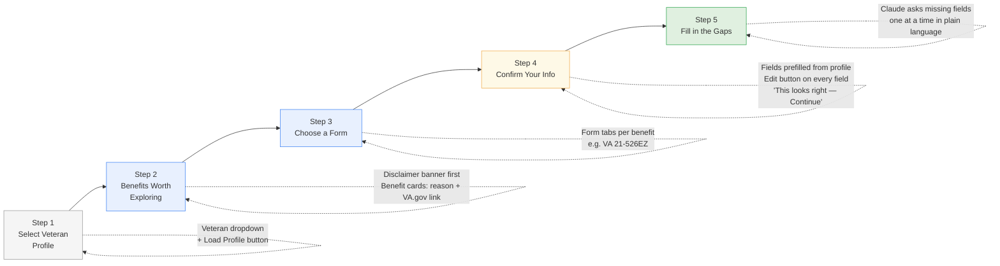
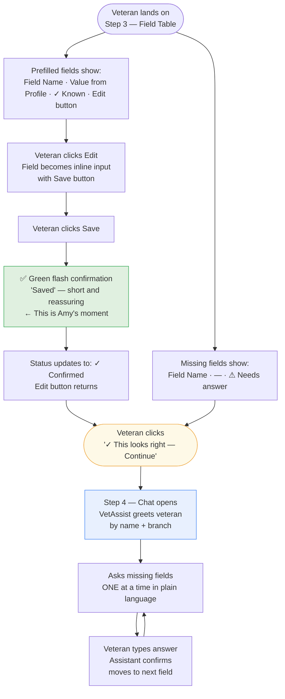

# VetAssist — Collaborator Brief

**Wilcore Innovation Challenge | April 20–27, 2026**

Hey — I'm building something for the challenge and wanted to show you what it is
before asking if you're interested in jumping in. Read this first, then decide.
No pressure either way.

---

## What we're building

**VetAssist** — an AI assistant that helps veterans figure out their VA benefits
and complete the required paperwork.

Here's the short version of why it matters:

> The average VA disability claim takes **102 days** to process —
> and that clock doesn't even start until the veteran figures out which forms to file.
> Most of them are still paper.

VetAssist changes that. You open it, it looks at your profile, tells you which
benefits you likely qualify for, shows you which forms you need, and prefills
everything it already knows. For the rest, it asks you in plain language — one
question at a time — like a conversation, not a questionnaire.

The output is printable or email-ready. No re-entering the same name, SSN, and
service dates on five different forms. Done once. Done right.

---

## The demo flow (what judges will see)



In the demo, we follow **Maria** — an Army veteran, two combat deployments,
30% disability rating for PTSD. She knows she may have benefits she hasn't filed for.
She opens VetAssist. In under two minutes, she knows exactly what she qualifies for,
which forms she needs, and what to bring.

---

## What's already done

The foundation is built and running locally. Here's where things stand:

**Working today:**
- FastAPI backend (Python, runs locally in one command)
- 3 synthetic veteran profiles — different branches, disabilities, service histories
- Claude-first eligibility — Claude reads each profile using its own VA knowledge
  and surfaces what's worth exploring. Hardcoded rules engine kicks in as a fallback
  when no API key is set. **No hardcoded decisions in the default path.**
- 5 real VA forms with field-level metadata and VA.gov links
- Field prefill logic — knows which fields it can fill vs. what to ask for
- Conversational Claude assistant (live with API key, graceful placeholder without)
- Single-page HTML frontend with disclaimer banner, benefit cards, form tables, chat

**Already in the repo:**
- Mockup images of non-digitized VA forms (DD-214, 21-4142, 21-0781) in `forms_to_verify/`
  to demonstrate the upload-and-extract concept in the video demo

**Not built yet (intentionally):**
- PDF output / printable package (deferred — doesn't affect the main demo)
- Real document OCR (stubbed out — the concept shows clearly in the demo)
- Authentication / database (not needed for a local MVP)

---

## Where I need help — and where you specifically fit

I'm not going to give you a generic role. Here's where I actually need your skills.

---

### Amy — Frontend & Accessibility

**Your background:** Design System Engineering Lead, Front-end Engineer,
Accessibility Specialist at Wilcore.

This project needs you more than anyone else on the frontend.

What the UI does right now: it's functional. Veteran selector, benefit cards with
disclaimers, form table with prefill status, chat box. It works.
It's not something you'd be proud to show at a presentation.

**Here's the UX flow you're working with:**



**Where you'd make this project:**

1. **Visual polish on `templates/index.html`**
   The entire UI is one HTML file with vanilla CSS — no framework, no build step.
   Pull it up, make it look like something Wilcore would be proud to demo.
   - Priority 1: Edit → Save confirmation flash (brief green "✓ Saved" animation)
   - Priority 2: Loading states (benefit spinner, form tab loading)
   - Priority 3: Field table hierarchy — prefilled vs. missing should read instantly
   - Priority 4: Paper form warning badge prominence (non-digitized forms need a
     clear visual signal — veterans need to know they may need to print and mail)

2. **The "before/after" designed visual**
   The strongest moment in our presentation will be a side-by-side: what a veteran
   does today (Google, paper forms, confusion) vs. what VetAssist does.
   You know how to make that land visually in a way that a judge remembers.
   This is the most important non-code deliverable. Figma, Canva, or designed HTML —
   whatever you're fastest in.

3. **Section 508 accessibility baseline**
   Since Wilcore has federal aspirations for this, judges will think about Section 508.
   If you can add basic aria labels, focus states, and WCAG AA color contrast —
   that's a credible signal that we've thought about this seriously.
   - aria-label on all interactive elements (buttons, inputs, select)
   - Visible focus ring on keyboard navigation
   - Color contrast: VA blue (#1a3a6b) on white passes; double-check green status labels

4. **Demo video resolution check**
   The recorded video demo needs to look good at 1080p. Make sure nothing looks
   blurry or misaligned at screen-capture resolution before we record.

**Time ask:** 4–8 hours across the week, heavily weighted toward Wed–Thu.
**What you'd own:** `templates/index.html` visual polish, before/after designed visual,
accessibility baseline, demo video sign-off.

---

### Nick — Engineering

**Your background:** Engineering Lead at Wilcore.

The backend and core logic are in solid shape. What I need from an engineering lead
is a second set of eyes on the architecture, help tightening the code, and a partner
who can speak credibly to Joe (CTO) when he asks the hard questions.

**Where you'd add real value:**

1. **DD-214 upload stub — highest demo value, 2–3 hours**

   `POST /api/upload` currently returns a descriptive not-implemented message.
   For the demo, it would be significantly more impressive to show the concept working —
   even a fake version.

   Here's exactly what to build:

   ```python
   # In main.py, replace the upload stub body with:
   #
   # Accept any file upload (don't actually process it in the stub).
   # Return hardcoded extracted fields that match the DD-214 mockup in forms_to_verify/.
   # The frontend would merge these into the prefill context.
   #
   # WHY hardcoded: this is a demo stub. We're showing the concept,
   # not the OCR pipeline. Real OCR comes post-MVP (AWS Textract).

   from fastapi import UploadFile, File

   @app.post("/api/upload")
   async def upload_document(file: UploadFile = File(...)):
       """
       DEMO STUB — simulates DD-214 OCR extraction.
       Returns hardcoded fields from the Maria Sanchez mockup.
       Post-MVP: replace with real OCR (pytesseract or AWS Textract).
       """
       return {
           "status": "extracted",
           "filename": file.filename,
           "extracted_fields": {
               "full_name":      "Maria Sanchez",
               "branch":         "Army",
               "service_start":  "2003-06-15",
               "service_end":    "2012-09-30",
               "discharge_type": "Honorable",
               "ssn_last4":      "****",
               "mos":            "68W — Healthcare Specialist",
           },
           "note": (
               "These fields were extracted from your document. "
               "Please verify each one before continuing."
           ),
       }
   ```

   Then in `templates/index.html`, add an upload button near the profile card
   that calls `POST /api/upload` and merges the returned fields into `state.verifiedFields`.
   The field table should update immediately to show what was extracted.

2. **Stress test eligibility edge cases**
   - Malformed date strings in veteran profiles (e.g. `"service_start": null`)
   - Missing profile fields that rules reference (e.g. no `disability_conditions` key)
   - Veteran profile with 0% disability rating but `service_connected_disability: true`
   - Claude returning non-JSON or partial JSON — does the fallback trigger correctly?

   Run these with `python -c "..."` test calls to `discover_benefits()` directly.
   Don't add a test framework — just confirm the happy path and the fallback are bulletproof.

3. **Architecture defense — read CLAUDE.md first**
   When judges or Joe ask "how would this work at scale?" or "what would the federal
   deployment look like?" — you're the person who can answer credibly.
   The CLAUDE.md file has the full roadmap: local JSON → VA API → Bedrock on GovCloud.
   Help me stress-test that story so we can answer follow-up questions confidently.

4. **Clean install verification on your machine**
   Before we record the demo video, do one full clean install on your laptop:
   ```bash
   git clone https://github.com/akaseahawk/VetAssist
   cd VetAssist
   pip install -r requirements.txt
   uvicorn main:app --reload
   # open http://localhost:8000, run the full happy path with Maria
   ```
   Find anything broken and we fix it together. This is the most important
   quality gate before recording.

**Time ask:** 4–8 hours across the week.
**What you'd own:** Upload stub implementation, edge case testing, architecture Q&A prep,
clean install verification.

---

## What the week looks like

| Day | Goal |
|-----|------|
| Mon Apr 20 | Challenge opens — decide if you're in, run the app locally |
| Tue–Wed | Amy: UI pass. Nick: code review + upload stub |
| Thu | Full demo run-through, catch anything broken |
| Fri | Record video demo, finalize submission materials |
| Mon Apr 27 | Deadline 11:59 PM ET |

---

## Getting it running (takes 3 minutes)

```bash
git clone https://github.com/akaseahawk/VetAssist
cd VetAssist
pip install -r requirements.txt
uvicorn main:app --reload
# open http://localhost:8000
```

No API key needed to run the app. The benefit discovery and chat assistant show
graceful fallback responses without one — that's fine for initial review.

---

## Why Wilcore specifically should care about this

Wilcore is an SDVOSB. We work with the VA. This project:
- Directly serves the veteran population we exist to support
- Maps to the challenge themes "Benefits at First Ask" and "Closing the Digital Divide"
- Has a credible path from this demo to a Wilcore federal proposal
- Could realistically become a real thing if it wins

And honestly — it's a project worth doing. Veterans deserve better than a 102-day wait
and a stack of paper forms they have to figure out alone.

---

## Questions?

Just message me. If you want to jump in, let me know which role fits and we'll
divide and conquer. The deadline is tight but the scope is real and the foundation
is already there.
