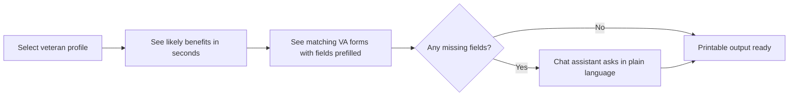

# VetAssist — Collaborator Brief

**Wilcore Innovation Challenge | April 20–27, 2026**

Hey — I'm building something for the challenge and wanted to show you what it is
before asking if you're interested in jumping in. Read this first, then decide.
No pressure either way.

---

## What we're building

**VetAssist** — an AI assistant that helps veterans figure out their VA benefits
and complete the required paperwork.

Here's the short version of why it matters:

> The average VA disability claim takes **102 days** to process —
> and that clock doesn't even start until the veteran figures out which forms to file.
> Most of them are still paper.

VetAssist changes that. You open it, it looks at your profile, tells you which
benefits you likely qualify for, shows you which forms you need, and prefills
everything it already knows. For the rest, it asks you in plain language — one
question at a time — like a conversation, not a questionnaire.

If you get a physical form in the mail (or at the VA office), you can photograph it
and VetAssist will read it and extract what it needs. It handles the forms that
aren't digital, which is a lot of them.

The output is printable or email-ready. No re-entering the same name, SSN, and
service dates on five different forms. Done once. Done right.

---

## The demo flow (what judges will see)



In the demo, we follow **Maria** — an Army veteran, two combat deployments,
30% disability rating for PTSD. She knows she may have benefits she hasn't filed for.
She opens VetAssist. In under two minutes, she knows exactly what she qualifies for,
which forms she needs, and what to bring.

---

## What's already done

The foundation is built and running locally. Here's where things stand:

**Working today:**
- FastAPI backend (Python, runs locally in one command)
- 3 synthetic veteran profiles — different branches, disabilities, service histories
- Rules-based eligibility engine for 5 VA benefit categories
- 5 real VA forms with field-level metadata and [VA.gov links](https://www.va.gov/vaforms/)
- Field prefill logic — knows which fields it can fill vs. what to ask for
- Claude conversational assistant (live with API key, graceful placeholder without)
- Single-page HTML frontend — veteran selector, benefit badges, form breakdown, chat

**Already in the repo:**
- Mockup images of non-digitized VA forms (DD-214, 21-4142, 21-0781) in `forms_to_verify/`
  to demonstrate the upload-and-extract concept in the video demo

**Not built yet (intentionally):**
- PDF output / printable package (deferred — doesn't affect the main demo)
- Real document OCR (stubbed out — the concept shows clearly in the demo)
- Authentication / database (not needed for a local MVP)

---

## Where I need help — and where you specifically fit

I'm not going to give you a generic role. Here's where I actually need your skills.

---

### Amy — Frontend & Accessibility

**Your background:** Design system engineering lead, front-end engineer,
accessibility specialist.

This project needs you more than anyone else on the frontend.

What the UI does right now: it's functional. Veteran selector, benefit badges,
form table with prefill status, chat box. It works. It's not something you'd
be proud to show at a presentation.

**Where you'd make this project:**

1. **Visual design pass on `templates/index.html`**
   The entire UI is one HTML file with vanilla CSS — no framework, no build step.
   Pull it up, make it look like something Wilcore would be proud to demo.
   Key things that need love: the form field table (status colors for prefilled/missing),
   the benefit badge layout, the overall page structure.

2. **The "before / after" visual**
   The strongest moment in our presentation will be a side-by-side: what a veteran
   does today (Google, paper forms, confusion) vs. what VetAssist does.
   You know how to make that land visually in a way that a judge remembers.

3. **Accessibility baseline**
   Since Wilcore has federal aspirations for this, judges will think about Section 508.
   If you can add basic aria labels, focus states, and color contrast that holds up —
   that's a credible signal that we've thought about this seriously.

4. **Demo polish**
   The recorded video demo needs to look good. Help make sure the UI is presentable
   at screen-capture resolution.

**Time ask:** 4–8 hours across the week, heavily weighted toward Wed–Thu.
**What you'd own:** `templates/index.html`, visual design decisions, demo video polish.

---

### Nick — Engineering

**Your background:** Engineering lead.

The backend and core logic are in solid shape. What I need from an engineering lead
is a second set of eyes on the architecture, help tightening the code, and a partner
who can speak credibly to the CTO (Joe Niquette) when he asks the hard questions.

**Where you'd add real value:**

1. **Code review and hardening**
   Look at `main.py`, `services/eligibility.py`, and `services/form_matcher.py`.
   The eligibility logic is rules-based Python — it works, but there are edge cases
   I'd want to talk through. Make sure the happy path is bulletproof for the demo.

2. **The upload concept**
   `POST /api/upload` currently returns a 501 with a clear explanation.
   For the demo, it would be more impressive if we could show the concept working —
   even a fake version where uploading the mockup image from `forms_to_verify/`
   triggers a hardcoded response showing "I extracted these fields from your document."
   This is maybe 2–3 hours of work and transforms the demo significantly.

3. **Architecture defense**
   When judges or Joe ask "how would this work at scale?" or "what would the federal
   deployment look like?" — you're the person who can answer that credibly.
   The `CLAUDE.md` file has the roadmap (local JSON → real VA API → Bedrock endpoint
   on GovCloud). Help me stress-test that story.

4. **Making sure it runs**
   Before we record the demo video, do one full clean install on your machine
   (`pip install -r requirements.txt` + `uvicorn main:app --reload`) and confirm
   the happy path works end-to-end. Find anything broken and we fix it together.

**Time ask:** 4–8 hours across the week.
**What you'd own:** Code review, upload concept stub, architecture Q&A prep.

---

## What the week looks like

| Day | Goal |
|-----|------|
| Mon Apr 20 | Challenge opens — decide if you're in, run the app locally |
| Tue–Wed | Amy: UI pass. Nick: code review + upload stub |
| Thu | Full demo run-through, catch anything broken |
| Fri | Record video demo, finalize submission materials |
| Mon Apr 27 | Deadline 11:59 PM ET |

---

## Getting it running (takes 3 minutes)

```bash
git clone https://github.com/akaseahawk/VetAssist
cd VetAssist
pip install -r requirements.txt
uvicorn main:app --reload
# open http://localhost:8000
```

No API key needed to run the app. The chat assistant shows a placeholder response
without one — that's fine for initial review.

---

## Why Wilcore specifically should care about this

Wilcore is an SDVOSB. We work with the VA. This project:
- Directly serves the veteran population we exist to support
- Maps to the challenge themes "Benefits at First Ask" and "Closing the Digital Divide"
- Has a credible path from this demo to a Wilcore federal proposal
- Could realistically become a real thing if it wins

And honestly — it's a project worth doing. Veterans deserve better than a 102-day wait
and a stack of paper forms they have to figure out alone.

---

## Questions?

Just message me. If you want to jump in, let me know which role fits and we'll
divide and conquer. The deadline is tight but the scope is real and the foundation
is already there.
