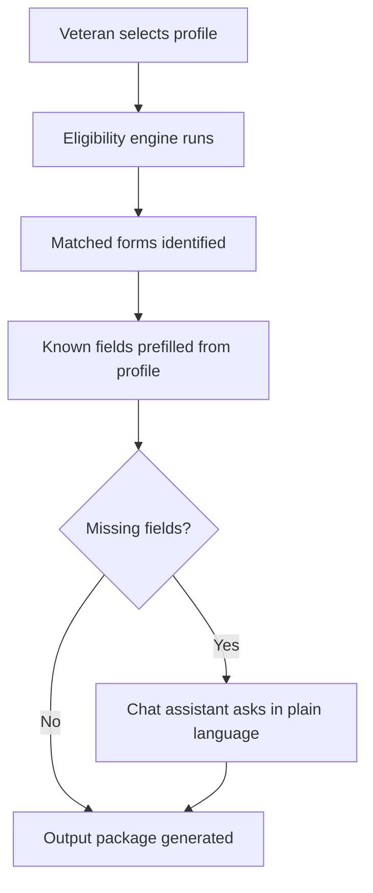

# VetAssist — Collaborator Brief

**Wilcore Innovation Challenge | April 20–27, 2026**

Want to help build something that actually matters? This is a one-week hackathon project
with a clear goal, a working foundation, and specific roles where you can make a real contribution.

---

## What is VetAssist?

VetAssist is an AI assistant that helps veterans navigate the VA benefits and forms process.

Right now, getting VA benefits is hard — not because veterans don't deserve them,
but because the process is fragmented, confusing, and full of paper forms that ask
for the same information over and over.

VetAssist changes that. It:

- Looks at a veteran's profile and figures out which benefits they likely qualify for
- Tells them exactly which forms they need
- Prefills every field it can from what it already knows
- Asks plain-language follow-up questions for the rest
- Handles forms that aren't fully digital (upload a scan — it extracts the context)
- Produces a printable or email-ready output package

It's not trying to replace VSOs or VA staff. It's trying to make sure veterans
show up to those conversations already knowing what they need and having half the paperwork done.

---

## Why Wilcore should care

Wilcore is an SDVOSB (Service-Disabled Veteran-Owned Small Business) that works with the VA.
This project directly serves the veteran population Wilcore was built to support,
and it's exactly the kind of idea that could become a federal proposal.

The Wilcore challenge rubric rewards:
- **Impact (30%)** — veterans getting benefits faster, with less confusion
- **Originality (25%)** — combining benefit discovery, form guidance, and AI-assisted completion in one tool
- **Feasibility (20%)** — this works locally today, with a clear path to federal deployment
- **Clarity (15%)** — the demo is one screen, easy to explain in 60 seconds
- **Collaboration (10%)** — that's where you come in

---

## What's already done

As of today:

- FastAPI backend running locally
- 3 synthetic veteran profiles in JSON (no real PII)
- Rules-based eligibility engine for 5 VA benefit categories
- Forms catalog with 5 real VA forms (field-level metadata, VA.gov links)
- Field prefill logic — shows what's known vs. missing
- Claude conversational assistant (live with API key, placeholder without)
- Single-page HTML frontend — veteran selector, benefit badges, form table, chat

---

## Where we need help

### Role 1 — Data & Eligibility Researcher
**Time: ~4–6 hours over the week**

You don't need to code. We need someone to:
- Review our 5 benefit categories and verify the eligibility conditions are roughly accurate
- Review our 5 VA forms and confirm the listed required fields match reality
- Add 1–2 more benefit/form pairs if there's a clear gap (e.g. caregiver benefits, pension)
- Write 2–3 sentences per benefit explaining it in plain language for the frontend
- Help make sure we can defend the data in front of judges

**What you'd own:** `data/benefits_rules.json` and `data/forms_catalog.json`

---

### Role 2 — Frontend / UX Polish
**Time: ~4–8 hours**

We have a working single-page HTML UI. It's functional but plain. We need:
- Visual polish — better layout, readable typography, color-coded status indicators
- A "before / after" visual or simple explainer for the demo slide
- Make the form field table easier to scan
- Optional: a simple "Generate Package" button mockup (doesn't need to work — just look real)
- Ensure the demo is visually presentable for a recorded video walkthrough

**What you'd own:** `templates/index.html`

---

### Role 3 — Demo Story & Presentation Support
**Time: ~3–5 hours**

This role doesn't require any coding at all. We need:
- Help drafting the 20-minute presentation deck (problem → solution → impact → roadmap → team)
- A before/after narrative script for the video demo
- Quantifying impact: find 1–2 cited stats about veteran benefits friction, wait times, or application volume
- Help frame the federal applicability story (VA contract potential, SDVOSB angle)
- Proofread the README and submission materials

**What you'd own:** The presentation deck and video script

---

## What the week looks like

| Day | Goal |
|-----|------|
| Mon | Kick off, assign roles, run the app locally |
| Tue–Wed | Parallel work: data review, UI polish, demo story |
| Thu | Integration pass — make sure everything works together |
| Fri | Record video demo, finalize submission materials |
| Weekend | Submit by Sunday 11:59 PM ET |

---

## How to get started

1. Clone the repo: `git clone https://github.com/akaseahawk/VetAssist`
2. Install dependencies: `pip install -r requirements.txt`
3. Run: `uvicorn main:app --reload`
4. Open: `http://localhost:8000`
5. Pick a veteran and click through the flow

No cloud accounts, no API keys needed to run the demo locally.

---

## Questions?

Reach out directly. This is a real project with a real deadline and a real shot at something
that could help veterans — and potentially become a Wilcore proposal.
