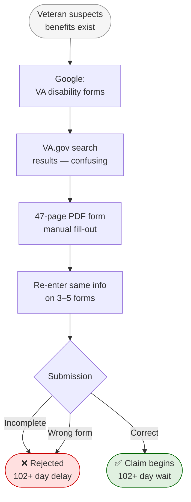
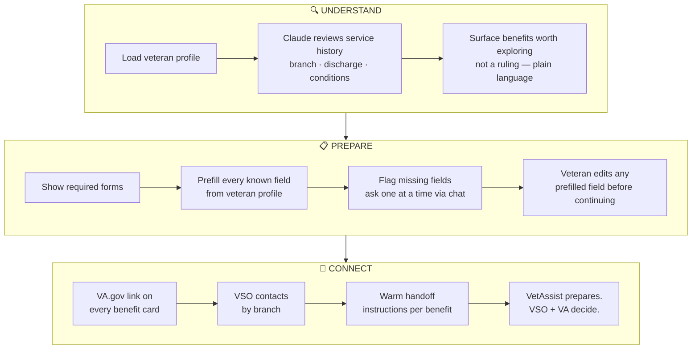
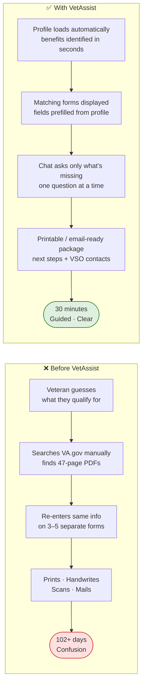
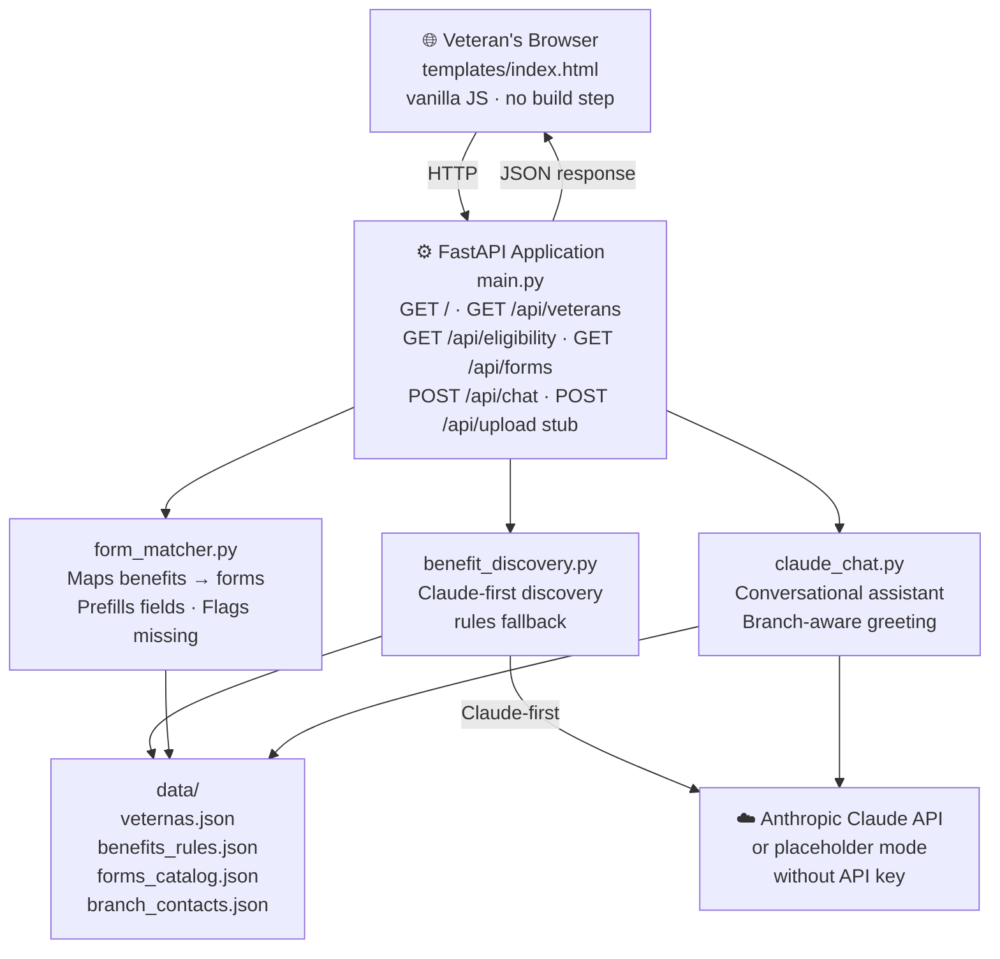
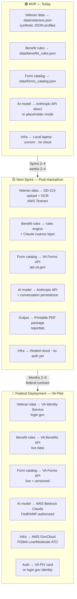
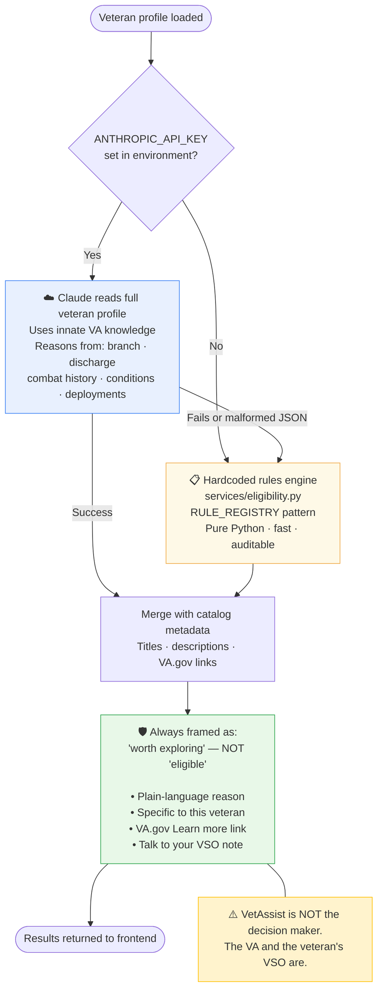
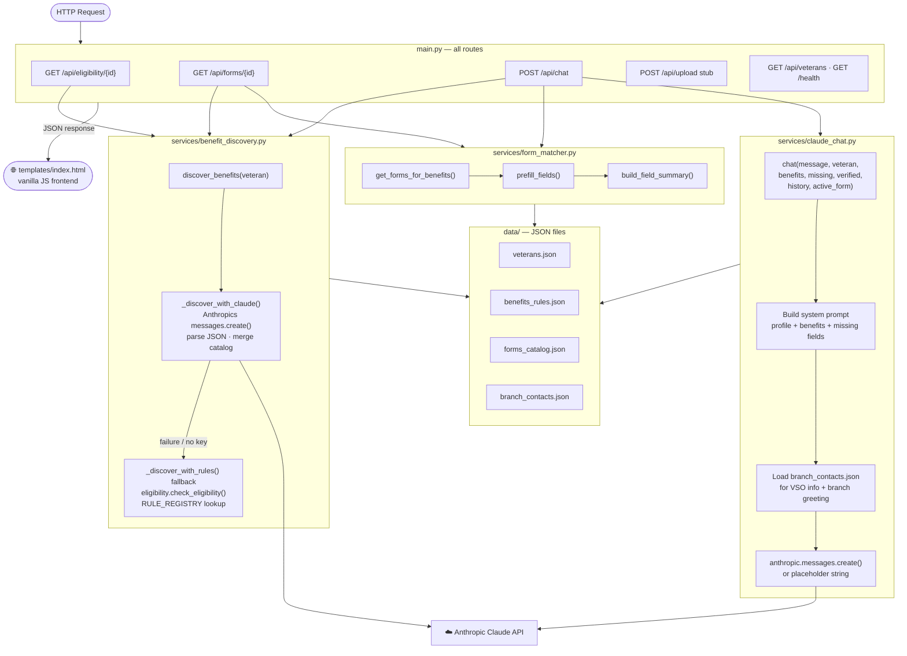
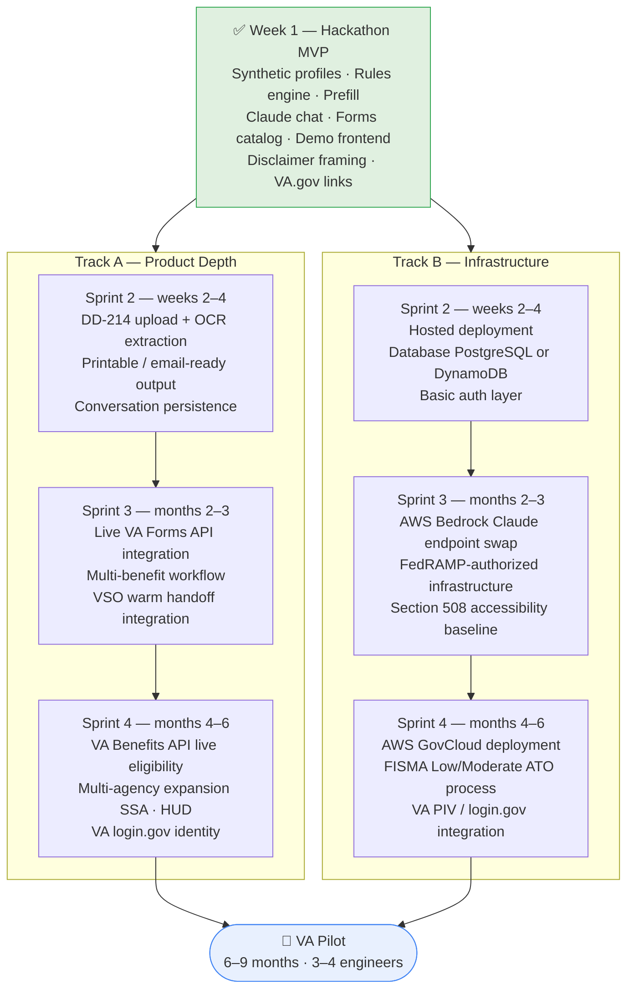

# VetAssist

**VA Benefits & Forms AI Assistant | Wilcore Innovation Challenge | April 20–27, 2026**

> Veterans deserve better than a stack of confusing forms and a Google search.
> VetAssist identifies likely benefits, explains required forms, prefills what it can,
> and asks plain-language follow-up questions for the rest.

```bash
git clone https://github.com/akaseahawk/VetAssist
cd VetAssist
pip install -r requirements.txt
cp .env.example .env          # optionally add ANTHROPIC_API_KEY
uvicorn main:app --reload
# open http://localhost:8000
```

The app runs without an API key. Claude responses fall back gracefully so the
demo works locally even in an offline environment.

---

## Act 1 — The Problem

### Why Veterans Are Left Behind

> *"The average VA disability claim takes 102.4 days to process — and that clock
> doesn't even start until the veteran figures out which forms to file."*
> — VA Benefits Administration, FY2023 Annual Benefits Report

Veterans earned their benefits through service and sacrifice. Getting those benefits
should not require a law degree, a research project, or a stack of paper forms
with overlapping fields filled out by hand.

**What veterans face today:**

- No single entry point to understand what they qualify for
- 3–5 forms per claim, many still flat PDFs or scanned images — not digital
- The same name, SSN, service dates, and address re-entered on every form
- Form instructions written for administrators, not veterans
- Incomplete submissions → rejections → months of delay → benefits never received

**Diagram 1 — The painful journey today:**



*Pain points: No guidance · Paper-first · Repeated data entry · Plain-language gap*

---

## Act 2 — The Solution

### What VetAssist Does

Three things, in order:

**Understand** — Read the veteran's profile and surface the benefits worth exploring
in plain language, with reasons specific to that veteran's situation.

**Prepare** — Show the required forms, prefill every field already known,
and ask for missing information conversationally — one question at a time.

**Connect** — Point the veteran to their VSO, the VA, and the specific VA.gov pages
they need. VetAssist prepares them. The VA and VSO make the final call.

**Diagram 2 — What VetAssist does:**



### Before vs. After

**Diagram 3 — Experience comparison:**



### Why Now

- The VA processes over 1 million disability claims per year ([VA FY2023 Benefits Report](https://www.benefits.va.gov/REPORTS/abr/))
- Post-9/11 veterans are aging into benefit eligibility windows now
- VA.gov digital modernization is ongoing but form complexity remains
- Claude and other frontier LLMs now reliably explain forms in plain language
- Wilcore's SDVOSB identity and existing VA relationships create a direct path to pilot this

### Impact

> **CEO lens:** Wilcore is an SDVOSB built to serve veterans. This project does exactly that —
> and it comes with a credible path to a federal proposal. A working prototype today is a BD
> asset tomorrow. The before/after story is memorable: veterans go from a 102-day confusion
> to a guided 30-minute process. That's the kind of impact that wins challenges and opens
> doors with VA program offices.

- Reduce time-to-submission from hours or days to under 30 minutes
- Reduce incomplete submissions through prefill and guided follow-ups
- Scalable to any federal benefit program with known forms and eligibility rules
- Maps directly to active VA modernization priorities
- Could support a Wilcore BD opportunity as a Task Order under an existing VA IDIQ or 8(a) sole-source

Quantified (conservative): If 10% of ~1M annual VA disability claims used a tool like this
and saved 2 hours each, that's ~200,000 veteran-hours recovered per year.

---

## Act 3 — How It Works

> **CTO lens (primary):** Every layer is replaceable without touching the others.
> JSON → DB, Anthropic → Bedrock, local → GovCloud. The MVP is the simplest
> credible version of the full architecture — not a throwaway.

### Diagram 4 — System Architecture



### Diagram 5 — Data Flow: MVP → Next Sprint → Federal



### Diagram 6 — Eligibility Approach: Claude-Driven with Rules Fallback



### Diagram 7 — Service Interaction Map



### Eligibility Engine Detail

**No hardcoded rules by default — Claude drives this.**

When `ANTHROPIC_API_KEY` is set, Claude reads the veteran's profile and uses its
own knowledge of VA benefits to surface what's worth exploring. It reasons from
branch, service dates, discharge type, conditions, and deployments — the same
factors a knowledgeable VSO would consider.

The hardcoded rules engine in `services/eligibility.py` runs only as a fallback
when no API key is configured. This keeps the app fully runnable for demos, development,
and offline environments without compromising the default experience.

**Critical framing (non-negotiable):**
- Always: *"worth exploring"* — never *"eligible"* or *"you qualify"*
- Always: disclaimer banner before any benefit cards
- Always: *"Talk to your VSO or the VA to confirm"* on every benefit
- Always: VA.gov link on every benefit card
- VetAssist is a preparation tool — the VA makes the determination

### What Is Real vs. Mocked

| Component | Status | Notes |
|-----------|--------|-------|
| Veteran profile loading | **Real** | Reads from `data/veterans.json` |
| Benefit discovery | **Real** | Claude-first; rules fallback |
| Form field prefill | **Real** | Maps profile fields to form field metadata |
| VA form titles and VA.gov links | **Real** | 5 actual VA forms with public URLs |
| Conversational assistant | **Real** (with API key) | Graceful placeholder without |
| Document upload / OCR | **Stub** | Endpoint exists; returns descriptive message |
| Printable PDF output | **Stub** | Endpoint exists; returns descriptive message |
| VA API integration | **Stub** | Uses local JSON instead |
| Veteran PII | **Synthetic** | No real data used |

---

## Act 4 — Implementation Path Forward

> **COO lens:** This is a bounded, realistic one-week build with a clear demo path.
> The scope is intentionally constrained — no database, no cloud, no auth.
> Every dependency is justified. If this moves past the challenge, the roadmap
> is phased and each sprint has a defined deliverable.

### Diagram 8 — Two-Track Implementation Roadmap



### Feasibility — Why This Works in One Week

| Task | Effort |
|------|--------|
| Backend + eligibility engine | 1–2 days |
| Forms catalog + prefill logic | 1 day |
| Frontend (HTML/JS) | 1 day |
| Claude chat integration | 0.5 days |
| Docs + diagrams + README | 0.5 days |
| Demo recording + submission | 0.5 days |
| **Total** | **~5–6 developer-days** |

**Why it stays simple:**
- No database — JSON files for everything
- No authentication — synthetic data only
- No cloud deployment — runs on any laptop with Python
- One HTML page — no framework, no build step
- Placeholder integrations — OCR and PDF output are stubs; core flow works without them

### Dependencies

- Python 3.10+
- FastAPI + uvicorn (lightweight, production-grade)
- Anthropic Python SDK (optional — app runs without it)
- No paid services required to run the MVP

### Risks and Mitigations

| Risk | Mitigation |
|------|-----------|
| Benefit suggestions are not legally precise | Always framed as "worth exploring." Disclaimer before every card. VSO recommended. |
| Form field metadata may drift from VA.gov | Catalog is versioned JSON; easy to update. Direct VA.gov links included. |
| Claude API unavailable or slow | Graceful rules fallback. Demo does not depend on live API. |
| OCR / PDF output not ready for demo | Clearly labeled stub. Core demo works without them. |
| Judges ask about PII / data security | Synthetic data only. No real veteran data stored anywhere. |
| "Why not just use VA.gov?" | VA.gov has no eligibility discovery, no prefill, no conversational guidance. VetAssist bridges those gaps. |

### Federal Applicability

> **CTO lens (primary):** The architecture is intentionally modular and swap-ready.
> The model layer is abstracted in `services/claude_chat.py` — one environment variable
> switches from Anthropic direct to AWS Bedrock. The data layer is JSON today and
> PostgreSQL or DynamoDB tomorrow with no service-layer changes. The eligibility engine
> is pure Python rules — no ML dependency, fully auditable, easy to extend.
> The federal deployment path runs through Bedrock on AWS GovCloud (FedRAMP-authorized)
> with a FISMA Low/Moderate ATO.

- **Primary agency:** Department of Veterans Affairs (VA)
  - Aligns with VA Digital Modernization Strategy and Benefits Modernization priorities
  - Directly addresses the "Benefits at First Ask" theme from the Wilcore challenge
- **Compliance path:**
  - Section 508: accessible HTML, keyboard-navigable, screen-reader compatible with minor additions
  - FedRAMP: swap Anthropic API for AWS Bedrock (Claude) on FedRAMP-authorized infrastructure
  - FISMA Low/Moderate: appropriate for a VA benefits guidance tool with synthetic or de-identified data
- **Contract structure:** Could be delivered as a Task Order under an existing VA IDIQ or via an 8(a) sole-source to Wilcore as an SDVOSB
- **Broader applicability:** Same architecture applies to any federal benefit program with known forms (SSA, HUD, USDA rural benefits)

### Why This Scores Well Against the Wilcore Rubric

| Criterion | Weight | How VetAssist Addresses It |
|-----------|--------|---------------------------|
| **Impact** | 30% | Reduces veteran friction in a high-stakes process; clear federal proposal path |
| **Originality** | 25% | Combines benefit discovery, form mapping, prefill, and conversational guidance — no single VA tool does all four |
| **Feasibility** | 20% | Runs locally today; realistic one-week scope; clear post-MVP roadmap |
| **Clarity** | 15% | One-screen demo, plain-language output, diagrams, before/after story |
| **Collaboration** | 10% | Three defined teammate roles with clear ownership and bounded time commitment |

Directly aligns with the Wilcore challenge themes: *"Benefits at First Ask"*
and *"Closing the Digital Divide"* — and with Wilcore's SDVOSB identity.

---

## Demo Narrative

> This is the story to tell in the video and presentation.

**Before:** Maria is an Army veteran. She knows she may have PTSD from her deployments
in Iraq and Afghanistan. She tries to file a claim but doesn't know where to start.
She Googles "VA disability forms," finds a 47-page PDF, and gives up.

**With VetAssist:**
1. Maria opens VetAssist and selects her profile
2. In seconds, she sees benefits worth exploring: disability compensation, PTSD benefits, VA health care
3. She sees matching forms — one flagged as "not fully digitized"
4. Most fields are already filled in from her profile (name, service dates, branch, conditions)
5. The chat assistant asks her one question at a time for the rest
6. She answers conversationally. The assistant confirms and moves to the next.
7. She sees a summary ready to bring to her VSO or the VA

**The before/after:** hours of confusion → under 30 minutes, guided.

---

## Repository Structure

```
VetAssist/
├── main.py                    # FastAPI app — all routes
├── requirements.txt           # Minimal dependencies
├── .env.example               # Environment variable template
├── .gitignore
├── README.md                  # This file
├── COLLABORATOR_BRIEF.md      # Plain-language teammate recruitment guide
├── CLAUDE.md                  # Architecture guide for Claude Code and developers
├── data/
│   ├── veterans.json          # 3 synthetic veteran profiles
│   ├── benefits_rules.json    # 5 benefit definitions (rules fallback)
│   ├── forms_catalog.json     # 5 VA form definitions with field metadata
│   └── branch_contacts.json  # VSO contacts + branch-specific benefit notes
├── services/
│   ├── benefit_discovery.py   # Claude-first discovery; rules fallback
│   ├── eligibility.py         # Hardcoded rules engine (fallback mode)
│   ├── form_matcher.py        # Form selection and field prefill
│   └── claude_chat.py         # Conversational assistant (Claude API)
├── forms_to_verify/
│   ├── README.md              # Explains folder purpose
│   ├── DD_214_mockup_example.png
│   ├── VA_21-4142_authorization_to_disclose_mockup.png
│   └── VA_21-0781_PTSD_stressor_statement_mockup.png
└── templates/
    └── index.html             # Single-page frontend (vanilla JS, no framework)
```

---

*VetAssist — Wilcore Innovation Challenge 2026*
*Synthetic data only. Not a real VA system. No real veteran PII used.*
*VetAssist helps veterans prepare. The VA and their VSO make the final determination.*
