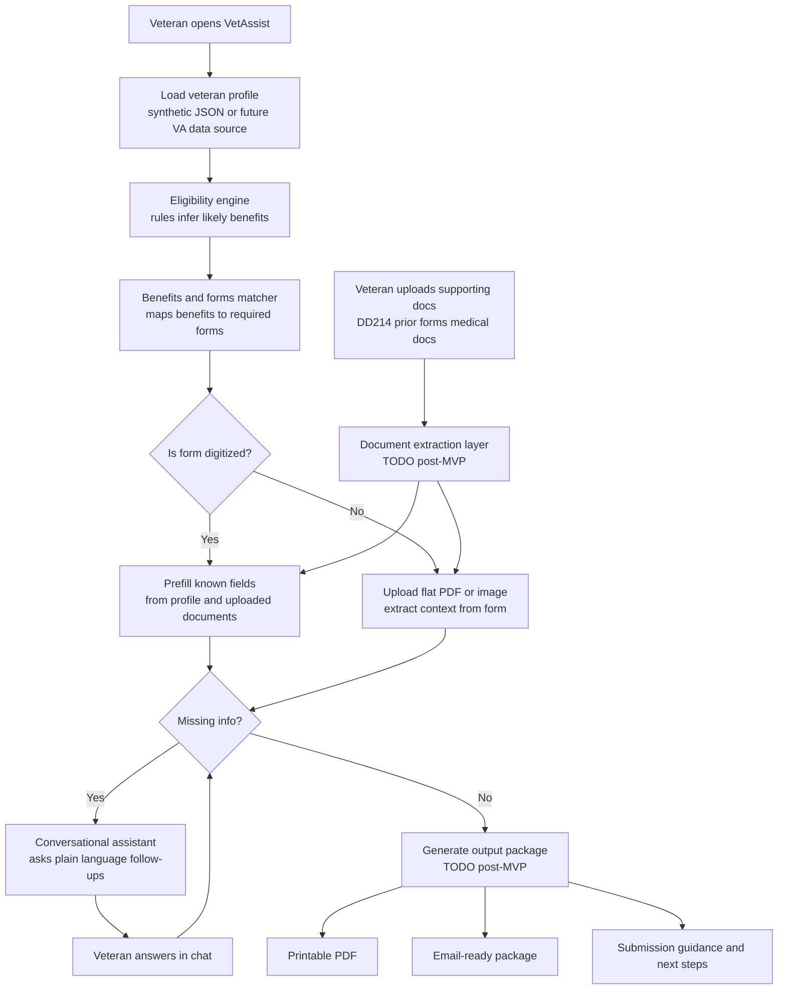
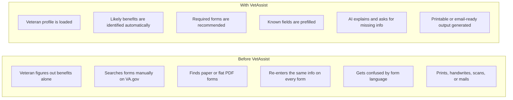
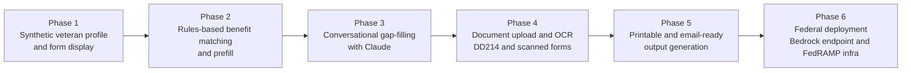

# VetAssist

**VA Benefits & Forms AI Assistant | Wilcore Innovation Challenge | April 20–27, 2026**

> Veterans deserve better than a stack of confusing forms and a Google search.
> VetAssist identifies likely benefits, explains required forms, prefills what it can,
> and asks plain-language follow-up questions for the rest.

---

## Quick Start

```bash
git clone https://github.com/akaseahawk/VetAssist
cd VetAssist
pip install -r requirements.txt
cp .env.example .env          # optionally add ANTHROPIC_API_KEY
uvicorn main:app --reload
# open http://localhost:8000
```

The app runs without an API key. Claude responses fall back to a placeholder string
so the demo works locally even in an offline environment.

---

## Problem

> *"The average VA disability claim takes 102.4 days to process — and that's after the veteran
> figures out which forms to file."*
> — VA Benefits Administration, FY2023 Annual Benefits Report

Veterans face a fragmented, confusing process for accessing the benefits they earned:

- **No single entry point** — veterans must figure out on their own which benefits they may qualify for
- **Form overload** — a single disability claim can require 3–5 forms with overlapping fields
- **Paper-first reality** — many VA forms are still flat PDFs or scanned images, not true digital forms
- **Repeated data entry** — veterans re-enter the same name, SSN, service dates, and address on every form
- **Plain language gap** — form instructions are written for administrators, not veterans
- **High stakes friction** — confusion leads to incomplete submissions, rejections, and delayed benefits

This is a solvable problem. The data already exists. The forms are known.
What's missing is a guide that connects them — in plain language, for the veteran.

---

## Solution

VetAssist is a local-first AI assistant that:

1. **Loads a veteran profile** (synthetic JSON in MVP; future: VA identity data or uploaded DD214)
2. **Runs a rules-based eligibility engine** to identify likely benefit categories
3. **Maps benefits to required VA forms** using a structured forms catalog
4. **Prefills every field it can** from the veteran's profile
5. **Flags what's still missing** and asks for it conversationally — one question at a time
6. **Supports non-digitized forms** — upload a flat PDF or image and extract context (post-MVP OCR)
7. **Generates a printable or email-ready output package** with all prefilled fields (post-MVP)

### System Architecture



---

## Why Now

- The VA processes over 1 million disability claims per year ([VA FY2023 Benefits Report](https://www.benefits.va.gov/REPORTS/abr/))
- Post-9/11 veterans are aging into benefit eligibility windows now
- VA.gov digital modernization is ongoing but form complexity remains
- Claude and other frontier LLMs now reliably explain forms in plain language
- Wilcore's SDVOSB identity and existing VA relationships create a direct path to pilot this

---

## Before vs. After



---

## Impact

> CEO lens: This is a mission-aligned product for an SDVOSB that works directly with the VA.
> A working prototype is a credible foundation for a Wilcore proposal.

- **Direct veteran impact:** Reduce time-to-submission from hours or days to under 30 minutes
- **Reduction in incomplete submissions:** Prefilling known fields and guided follow-ups reduces errors that cause rejections
- **Scalable:** The same architecture applies to any benefit category or agency with known forms and eligibility rules
- **Proposal potential:** VetAssist maps directly to active VA modernization priorities and could support a Wilcore BD opportunity
- **Alignment with Wilcore's SDVOSB mission:** Built by and for the veteran-serving community

Quantified (conservative estimates):
- If 10% of the ~1M annual VA disability claims used a tool like this and saved 2 hours each,
  that's ~200,000 veteran-hours recovered per year
- Reduced re-submission rates could cut claims processing time at the VA, compounding the impact

---

## Feasibility

> COO lens: This is a realistic one-week build. The scope is bounded, the dependencies are minimal,
> and the demo path is clear.

### MVP is realistic because:
- **No database** — JSON files for everything
- **No authentication** — synthetic data only
- **No cloud deployment** — runs on any laptop with Python
- **One HTML page** — no framework, no build step
- **Synthetic data** — no real veteran PII, no VA API integration required
- **Placeholder integrations** — OCR and PDF output are stubs; the core flow works without them

### Effort estimate (one week, 1–3 people):
| Task | Effort |
|------|--------|
| Backend + eligibility engine | 1–2 days |
| Forms catalog + prefill logic | 1 day |
| Frontend (HTML/JS) | 1 day |
| Claude chat integration | 0.5 days |
| Data review + README | 0.5 days |
| Demo recording + submission | 0.5 days |
| **Total** | **~5–6 developer-days** |

### Dependencies:
- Python 3.10+
- FastAPI + uvicorn (lightweight, production-grade)
- Anthropic Python SDK (optional — app runs without it)
- No paid services required to run the MVP

---

## What Is Real vs. Mocked

| Component | Status | Notes |
|-----------|--------|-------|
| Veteran profile loading | **Real** | Reads from `data/veterans.json` |
| Eligibility engine | **Real** | Python rules in `services/eligibility.py` |
| Form field prefill | **Real** | Maps profile fields to form field metadata |
| VA form titles and VA.gov links | **Real** | 5 actual VA forms with public URLs |
| Conversational assistant | **Real** (with API key) | Placeholder string without key |
| Document upload / OCR | **Placeholder** | Endpoint exists; returns 501 |
| Printable PDF output | **Placeholder** | Endpoint exists; returns 501 |
| VA API integration | **Placeholder** | Uses local JSON instead |
| Veteran PII | **Synthetic** | No real data used |

---

## MVP Scope

Five covered benefit categories:
1. VA Health Care Enrollment (Form 10-10EZ)
2. Disability Compensation (Form 21-526EZ)
3. PTSD / Mental Health Benefits (Form 21-0781)
4. GI Bill Education Benefits (Form 22-1990)
5. VA Home Loan Guarantee (Form 26-1880)

Three synthetic veteran profiles covering different service and eligibility scenarios.

One frontend screen showing: profile summary, benefit eligibility badges,
matched forms with prefill status, and a conversational assistant chat area.

---

## Risks and Mitigations

| Risk | Mitigation |
|------|-----------|
| Eligibility rules are approximate | Clearly stated as "likely eligible" — not a legal determination. Recommend VSO review. |
| Form field metadata may drift from VA.gov | Catalog is versioned in JSON; easy to update. Includes direct VA.gov links. |
| Claude API unavailable or slow | Graceful placeholder fallback. Demo does not depend on live API. |
| OCR / PDF output not ready for demo | These are clearly labeled TODO. Demo works without them. |
| Judges ask about PII / data security | Synthetic data only. No real veteran data stored anywhere. |
| "Why not just use VA.gov?" | VA.gov has no eligibility discovery, no prefill, and no conversational guidance. VetAssist bridges those gaps. |

---

## What Was Intentionally Left Out

To keep the MVP achievable in one week, the following were deliberately excluded:

- **Real veteran authentication** — would require VA login.gov integration
- **Database** — JSON files are sufficient for a demo
- **PDF generation** — deferred to post-MVP; does not affect the core flow
- **OCR for scanned forms** — placeholder; requires pytesseract or Textract
- **Multi-agency coverage** — focused on VA only for MVP clarity
- **Mobile-optimized UI** — single responsive page is sufficient for demo

---

## Demo Narrative

> This is the story to tell in the video and presentation.

**Before:** Maria is an Army veteran. She knows she may have PTSD from her deployments in Iraq
and Afghanistan. She tries to file a claim but doesn't know where to start.
She Googles "VA disability forms," finds a 47-page PDF, and gives up.

**With VetAssist:**
1. Maria opens VetAssist and selects her profile
2. In seconds, she sees she likely qualifies for: disability compensation, PTSD benefits, and VA health care
3. She sees three forms — one of them flagged as "not fully digitized"
4. Most fields are already filled in from her profile (name, service dates, branch, conditions)
5. The chat assistant asks her one question at a time for the rest: "Can you describe the event that led to your PTSD diagnosis? In your own words — there's no wrong answer."
6. She answers conversationally. The assistant confirms each answer and moves to the next.
7. She sees a summary of her completed form data, ready to download or email.

**The before/after:** hours of confusion → under 30 minutes, guided.

---

## Roadmap



---

## Federal Applicability

> CTO lens: The architecture is designed to be swappable. Claude via Anthropic API today;
> Claude via AWS Bedrock on GovCloud tomorrow.

- **Primary agency:** Department of Veterans Affairs (VA)
  - Aligns with VA Digital Modernization Strategy and Benefits Modernization priorities
  - Directly addresses the "Benefits at First Ask" theme from the Wilcore challenge
- **Compliance path:**
  - Section 508: accessible HTML, keyboard-navigable, screen-reader compatible with minor additions
  - FedRAMP: swap Anthropic API for AWS Bedrock (Claude) on FedRAMP-authorized infrastructure
  - FISMA Low/Moderate: appropriate for a VA benefits guidance tool with synthetic or de-identified data
  - FISMA High / PII handling: requires additional controls if storing real veteran data
- **Contract structure:** Could be delivered as a Task Order under an existing VA IDIQ or via an 8(a) sole-source to Wilcore as an SDVOSB
- **Broader applicability:** The same architecture works for any federal benefit program with known forms and eligibility rules (SSA, HUD, USDA rural benefits)

---

## What It Would Take to Productionize

1. **Identity and authentication** — VA login.gov or PIV card integration (~1 sprint)
2. **Real veteran data integration** — VA Benefits API or eBenefits data feed (~2 sprints)
3. **OCR pipeline** — AWS Textract for scanned form extraction (~1 sprint)
4. **PDF output** — reportlab or weasyprint for printable packages (~1 sprint)
5. **Bedrock migration** — swap Anthropic API for Claude on AWS Bedrock (~0.5 sprints)
6. **ATO process** — FISMA authorization, pen testing, privacy impact assessment (~3–6 months)
7. **VSO partnership** — integrate with Veterans Service Organizations for warm handoffs

**Estimated path to VA pilot:** 6–9 months with a small team of 3–4 engineers.

---

## Team Role Opportunities

| Role | What They Own | Skills |
|------|--------------|--------|
| AI/Backend Engineer | `main.py`, `services/`, eligibility logic | Python, FastAPI, LLM APIs |
| Data Researcher | `data/*.json`, VA form accuracy, benefit rules | Research, VA domain knowledge |
| Frontend Developer | `templates/index.html`, UI polish, demo video | HTML, CSS, vanilla JS |
| Presenter / Storyteller | Slide deck, demo script, submission narrative | Communication, research |

---

## Why This Scores Well Against the Wilcore Rubric

| Criterion | Weight | How VetAssist Addresses It |
|-----------|--------|---------------------------|
| **Impact** | 30% | Reduces veteran friction in a high-stakes process; clear federal proposal path |
| **Originality** | 25% | Combines benefit discovery, form mapping, prefill, and conversational guidance — no single VA tool does all four |
| **Feasibility** | 20% | Runs locally today; realistic one-week scope; clear post-MVP roadmap |
| **Clarity** | 15% | One-screen demo, plain-language output, Mermaid diagrams, before/after story |
| **Collaboration** | 10% | Three defined teammate roles with clear ownership and bounded time commitment |

This project also directly aligns with the Wilcore challenge's government-aligned themes:
*"Benefits at First Ask"* and *"Closing the Digital Divide"* — and with Wilcore's SDVOSB identity.

---

## Repository Structure

```
VetAssist/
├── main.py                    # FastAPI app — all routes
├── requirements.txt           # Minimal dependencies
├── .env.example               # Environment variable template
├── .gitignore
├── README.md                  # This file
├── COLLABORATOR_BRIEF.md      # Plain-language teammate recruitment guide
├── CLAUDE.md                  # Architecture guide for Claude Code
├── data/
│   ├── veterans.json          # 3 synthetic veteran profiles
│   ├── benefits_rules.json    # 5 benefit definitions with eligibility rules
│   └── forms_catalog.json     # 5 VA form definitions with field metadata
├── services/
│   ├── eligibility.py         # Rules-based benefit matching
│   ├── form_matcher.py        # Form selection and field prefill
│   └── claude_chat.py         # Conversational assistant (Claude API)
└── templates/
    └── index.html             # Single-page frontend
```

---

*VetAssist — Wilcore Innovation Challenge 2026*
*Synthetic data only. Not a real VA system. No real veteran PII used.*
